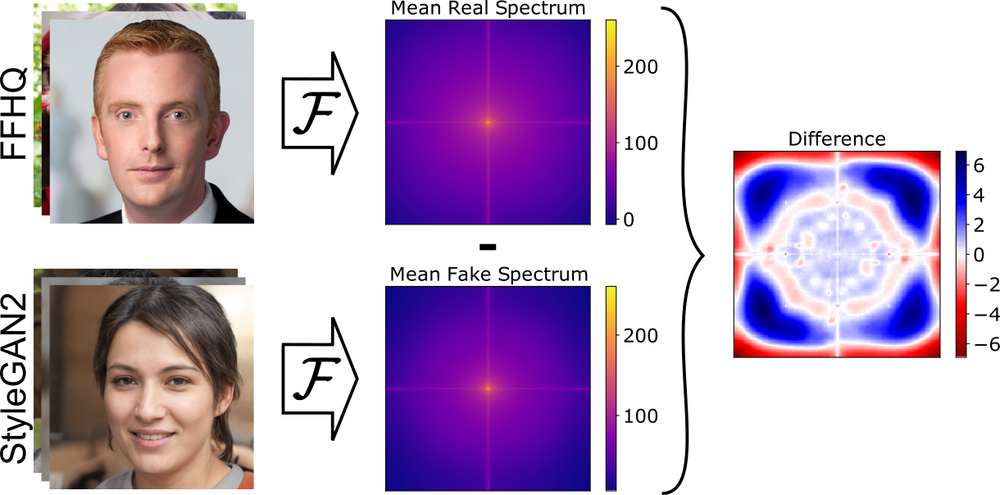
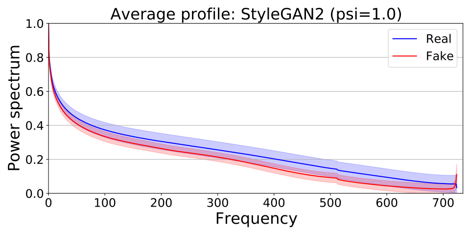
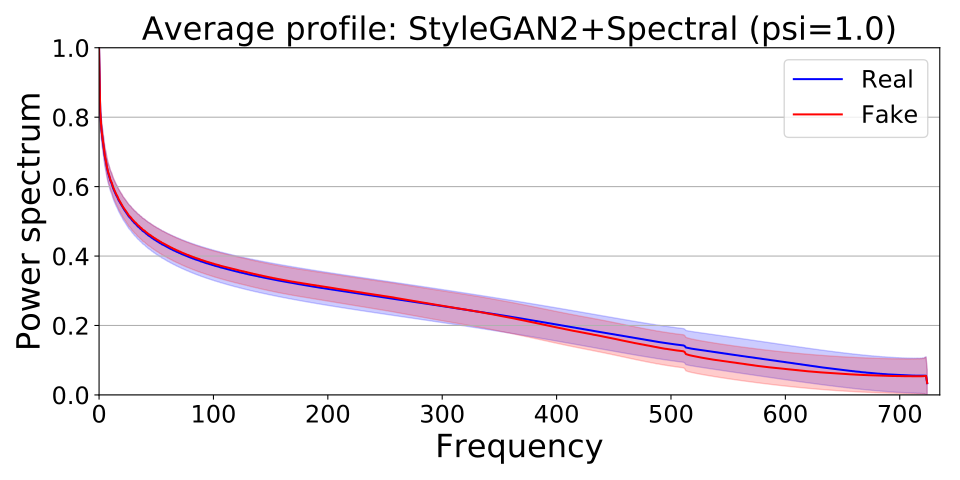

# SpectralGAN: Spectral Distribution Aware Image Generation
* Authors: Steffen Jung and Margret Keuper
* Paper: https://arxiv.org/abs/2012.03110
* Code to train DCGAN-like architectures in PyTorch: https://github.com/steffen-jung/SpectralGAN
* This code is an extension of [stylegan2-ada](https://github.com/NVlabs/stylegan2-ada)

# Motivation
Commonly used Generative Adversarial Networks (GANs) are not able to learn the distribution of real datasets in the frequency domain.


Our method adds an additional discriminator increasing the spectral fidelity.
## Spectral fidelity without our method


## Spectral fidelity with our method


# Requirements
Same as in [stylegan2-ada](https://github.com/NVlabs/stylegan2-ada).

# Usage Example
Usage is the same as explained in [stylegan2-ada](https://github.com/NVlabs/stylegan2-ada), however, you need to use ```train_spectral.py``` instead of ```train.py```.

Example to finetune StyleGAN2:
```
python train_spectral.py \
   --resume /path/to/network.pkl \
   --data /path/to/tfrecords \
   --gpus 4 \
   --outdir /path/to/folder \
   --kimg 7000 \
   --cfg stylegan2 \
   --aug noaug \
   --metrics fid50k_full
```

# Citation
```
@inproceedings{Jung2021SpectralGAN,
   title     = {Spectral Distribution Aware Image Generation},
   author    = {Steffen Jung and Margret Keuper},
   booktitle = {Thirty-Fifth AAAI Conference on Artificial Intelligence},
   year      = {2021}
}
```

# References
* This code is an extension of "StyleGAN2 with adaptive discriminator augmentation (ADA)": https://github.com/NVlabs/stylegan2-ada
